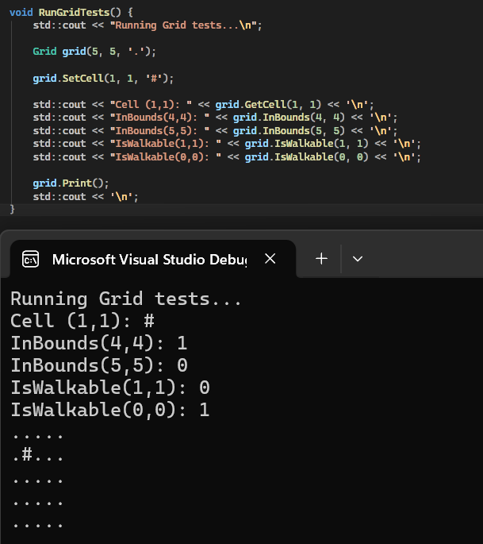
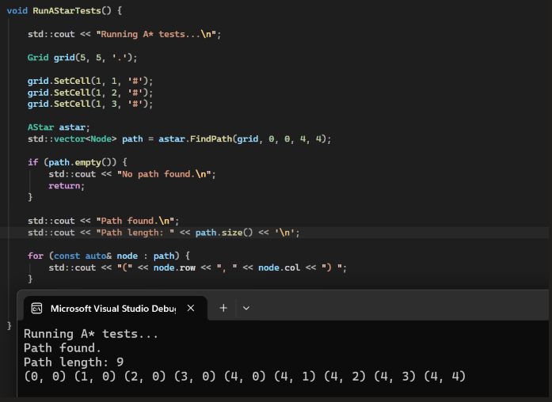
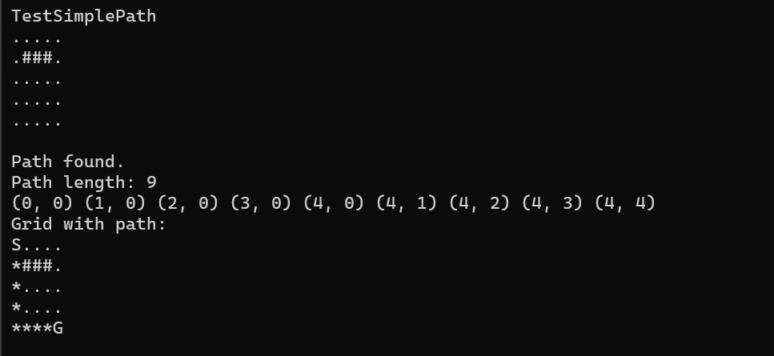
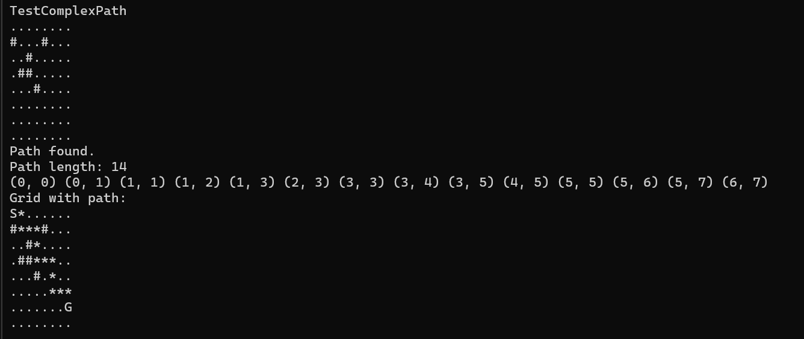
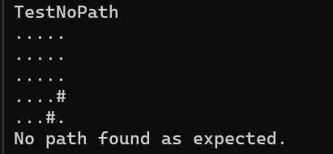

## Introduction

The goal of this project was to build a modern C++ application capable of solving a pathfinding problem using the A* algorithm. In simple terms, the aim was to determine whether a computer could find the shortest path from point A to point B (or from S to G on a grid) while avoiding blocked cells.

The final implementation of this project developed through an iterative process. A weekly diary was kept to document the challenges, decisions, and progress made throughout the project.

---

## Initial Approach

The first step was creating a basic printed grid to visualise the problem space:

```cpp
int main() {
    vector<string> map = {
        ".....",
        ".....",
        ".....",
        ".....",
        "....."
    };
    for (int r = 0; r < map.size(); r++) {
        cout << map[r] << std::endl;
    }
    return 0;
}
```

Breaking no new ground here sure, but this helped me visualise the overall process. And also realise that strings would not be a viable solution!

My next immediate thought was directions. How would the computer know which way was up and down, left and right? If point is (0,0) on a graph, then one space right is (0,1). Left is (0,-1). But picturing this on a graph was a mistake as I found out soon enough. 

Following on my current logic, down would be (-1,0) and up would be (1,0). When I printed the co-ords of each position in my grid up and down were reversed. This is because in programming grids, row increases downward, and column to the right. So a down from point (1,1) on a grid would be (2,1). This was the first lesson of many during this project.

Now that I had this logic sorted out I created my first directions 2D array.

```cpp
int directions[4][2] = {
    {-1, 0},  // up
    { 1, 0},  // down
    { 0,-1},  // left
    { 0, 1}   // right
};
```
Then from here, when I had a good idea of the fundamentals of the grid and how these simple concepts would work, I moved onto an object-oriented structure, and finally a working A* search with closed lists, cost tracking, path reconstruction and tests. This workflow of building A* as smaller concepts that were understood one at a time suited me perfectly.

# Core Concepts

## Grid

The first component I completed was the Grid class, which I had coded in main first, as stated in the introduction. Before I could even begin to think about algorithms and pathfinding, I needed a way to represent free cells, blocked cells, and map dimensions. This made grid the natural starting point of the project.

Also as I previously mentioned, I deduced fairly quickly that strings would not be viable in the long term for this project. I quickly switched to `std::vector<std::vector<char>>> map_` as it gave me the ability to have individual editable cells.

I also was printing this initially using 

```cpp
for (int r = 0; r < map.size(); r++) {
    for (int c = 0; c < map[r].size(); c++) {
        std::cout << map[r][c];
        }
    std::cout << std::endl;
}
```
This index-based loop is more c style than c++, instead I switched to a range based for loop. 

```cpp
for (const auto& row : map_) {
    for (char cell : row) {
        std::cout << cell;
    }
    std::cout << '\n';
}
```
Range-based for loops are preferred over index-based loops when iterating over all elements of a container. Index-based loops introduce unnecessary complexity through manual bounds management, creating potential for off-by-one errors and requiring the reader to verify correctness of loop conditions. 

[Range based for loops](https://en.cppreference.com/w/cpp/language/range-for.html)

#### Purpose

The main role of the Grid class is to separate map storage from pathfinding logic. The grid is responsible for answering environmental questions such as

- Is the coordinate inside the map?
- Is a tile walkable?
- What symbol should be stored in a cell?

I defined these core questions my grid class needed to answer, and built those functions first. This gave me a stable foundation to work from. Path printing was added later, but the essential structure was already in place. 

So I got to work on the grid class, and declared my attributes and methods.

```cpp
class Grid {
public:
	Grid(int rows = 5, int cols = 5, char fill = '.');

	void SetCell(int r, int c, char value);
	char GetCell(int r, int c) const;

	bool InBounds(int r, int c) const;
	bool IsWalkable(int r, int c) const;

	int Rows() const;
	int Cols() const;

	void Print() const;
	void PrintPath(
		const std::vector<Node>& path,
		int startRow, int startCol,
		int goalRow, int goalCol
	) const;

private:
	std::vector<std::vector<char>> map_;
};
```
The Grid class is intentionally simple, but its design decisions matter because all pathfinding behaviour sits on top of it.

- SetCell, which lets me set the start and goal
- GetCell, which lets A* read whats in that cell
- InBounds, which is a bounds check
- IsWalkable, which checks if a cell is walkable or not
- Rows and Cols, which return the number of rows and cols
- Print and PrintPath whcih will print the starting grid and final grid respectively

The constructor allows the grid size and fill character to be chosen dynamically
```cpp
Grid(int rows = 5, int cols = 5, char fill = '.');
```
In GetCell, I treat out of bounds co-ordinates as blocked cells '#'. It means that I don't have to write in a wall around every grid, and instead these invalid positions can be treated as walls, which simplifies logic later on when I am expanding the search.
```cpp
char Grid::GetCell(int r, int c) const {
    if (!InBounds(r, c)) return '#'; 
    return map_[r][c];
}
```
When I had this code up and running along with tests, I asked ChatGPT if I could modernize it further. It suggested that instead of using map.size() like below 
```cpp
bool Grid::InBounds(int r, int c) const {
    return r >= 0 && r < (int)map_.size()
        && c >= 0 && c < (int)map_[0].size();
}
```
I should switch to using std::ssize to get a signed size directly. 
```cpp
bool Grid::InBounds(int r, int c) const {
    return r >= 0 && r < std::ssize(map_)
        && c >= 0 && c < std::ssize(map_[0]);
}
```
The reason for this is because `map.size()` returns an unsigned value, which can cause awkward comparisons when checking negative indices, whereas `std::ssize` returns a signed value and makes bound checking safer and more consistent.

### Grid Tests

I also wrote some simple tests for the grid before moving on. These checked:

- whether a cell could be set and retrieved correctly
- whether InBounds() behaved correctly for valid and invalid coordinates
- whether blocked cells were correctly treated as non-walkable
- whether the grid printed as expected

The grid test file shows this clearly




## Separating Concerns

Another important decision was made at this point which paralysed my progress for awhile. I needed to determine the overall architecture of the entire project. I knew that I would have an AStar class and a Node class but what should I put in which? 

Similar to the questions I asked myself at the start of the grid class I defined roles for each class.

- Grid is the environment
- Node is the search state
- AStar is the algorithm

The Grid class only stores map data and handles environment-related operations such as bounds, walkability, and printing. The Node struct stores the state of a visited or unvisited position in the search, including costs and parent information. The AStar class is responsible for movement rules, heuristic calculation, open and closed set handling, and path reconstruction.

This question first came up when I was deciding where to put movement directions. It would have been possible to leave them in main() or force them into the Grid class, but neither felt right. Directions are not a property of the environment itself, and they are not a property of a single node. They are a rule used by the algorithm when expanding neighbours. Because of that, the final decision was to keep them inside AStar.

This might seem like a small design choice, but it reflects a broader principle: each part of the program should have one clear responsibility. Once that principle was established, the rest of the project became easier to organise.

## Node

The node struct represents an individual search state. It stores
- row and col 
- gCost, the known cost from the start 
- hCost, the heuristic estimate to the goal 
- parentRow and parentCol, which store where the node came from

```cpp
struct Node {
    int row{};
    int col{};

    int gCost{};
    int hCost{};

    int parentRow{ -1 };
    int parentCol{ -1 };

    Node() = default;
    Node(int row, int col, int gCost, int hCost, int parentRow = -1, int parentCol = -1);

    [[nodiscard]] int FCost() const {
        return gCost + hCost;
    }
};
```

Here the choice to use a struct rather than a full class was made because Node is essentially a compact data carrier. The only behavior it includes is FCost(), which returns the sum of the path cost so far and the heuristic estimate.

This is the main value used to prioritise nodes in A*.

Originally, nodes were built field by field:

```cpp
Node startNode;
startNode.row = startRow;
startNode.col = startCol;
startNode.gCost = 0;
startNode.hCost = Heuristic(startRow, startCol, goalRow, goalCol);
startNode.parentRow = -1;
startNode.parentCol = -1;
```
This way of constructing was also being use to create the neighbor nodes, when expanding neighbours. As you can see it's not too pretty and very repetitive. So I asked ChatGPT how I could reduce repetition when constructing these nodes. It first suggested adding helper functions within AStar
```cpp
Node AStar::CreateStartNode(
    int startRow,
    int startCol,
    int goalRow,
    int goalCol
) const {
    return Node{
        startRow,
        startCol,
        0,
        Heuristic(startRow, startCol, goalRow, goalCol),
        -1,
        -1
    };
}

Node AStar::CreateNeighbourNode(
    int neighbourRow,
    int neighbourCol,
    int proposedGCost,
    int goalRow,
    int goalCol,
    const Node& current
) const {
    return Node{
        neighbourRow,
        neighbourCol,
        proposedGCost,
        Heuristic(neighbourRow, neighbourCol, goalRow, goalCol),
        current.row,
        current.col
    };
}
```
But this was not ideal, the whole point was to reduce the clutter in AStar. So I suggested moving Node construction into its own cpp class, which made the most sense. Up to this point Node had no cpp and was only a header file containing the struct. So I added the default and parameterized constructor:
```cpp
Node() = default;
Node(int row, int col, int gCost, int hCost, int parentRow = -1, int parentCol = -1);
```
A default constructor is needed as when I create a vector of Nodes `std::vector<Node>`, which you will see in my AStar class, requires it when allocating and resizing internal storage. Basically I need a blank node before I start filling in values.

And then in Node.cpp I added the intialiser method
```cpp
Node::Node(int row, int col, int gCost, int hCost, int parentRow, int parentCol)
    : row(row), col(col), 
      gCost(gCost), hCost(hCost), 
      parentRow(parentRow), parentCol(parentCol)
{}
```
This method does not include the parentRow and parentCols as this will be the same for every Node. And we can use:
```cpp
Node startNode(startRow, startCol, 0, Heuristic(startRow, startCol, goalRow, goalCol));
```
To construct the nodes each time now. A significant reduction in clutter and improvement in readability as nodes can be created in a single line rather than being declared and populated field by field.

## AStar

Once I had a grid representation and a node type, I was ready to build the actual pathfinding algorithm.

The AStar class is where the main algorithm is implemented. First I defined what responsibilities AStar has.

It needs to: 
- Accept a grid
- Accept a start and goal position
- Explore valid neighbours
- Use a heuristic to guide the search
- Keep track of open and closed states
- Return a final path

So my initial methods were
- Heuristic
- FindPath
- ExpandNeighbours

I also defined my neighbours here
```cpp
namespace {
    constexpr std::array<std::pair<int, int>, 4> Directions{
        std::pair{-1, 0},  // up
        std::pair{1, 0},   // down
        std::pair{0, -1},  // left
        std::pair{0, 1}    // right
    };
}
```
A few changes here to note from my original directions array. As I coded I constantly asked ChatGPT if any improvements could be made, or if my code could be made safer.

I use `namespace` giving directions internal linkage, so it is invisible outside this cpp file. This is the modern alternative to static. Since Directions is an implementation detail of the A* algorithm, nothing outside this file should know it exists.

`constexpr` tells the compiler that Directions is a compile-time constant, so the value is known before the program runs. 

This means
- Zero runtime cost to initialise it
- The compiler can optimize loops over it aggressively
- Enforces nobody accidentally mutates it at runtime.

`std::pair<int, int>` is used because each direction is naturally a pair of two related integers `(rowOffset, colOffset)`. `std::pair` is a lightweight, standard way to group them without defining a whole struct. It also enables a clean structured binding in the loop `for (const auto& [rowOffset, colOffset] : Directions)` which is used in ExpandNeighbours.

So this approach is basically zero-cost at runtime whilst also being safer.

## Heuristic

A heuristic is an estimate of how close a given state is to a goal, in this case it will be used to guide AStar. For this project I considered two common options: Manhattan distance and Euclidean distance.

### Manhattan

The Manhattan heuristic is the sum of the horizontal and vertical distances between two points: the start and the goal. A useful way to visualise it is by thinking of movement through city blocks, which is where the name *Manhattan* comes from.

The Manhattan distance between two points `(x1, y1)` and `(x2, y2)` is:

`d = |x1 - x2| + |y1 - y2|`

This generalises to *n* dimensions as:

`d = Σ |pi - qi|`

This heuristic is best suited to **4-directional movement**, where movement is only allowed up, down, left, and right.

---

### Euclidean

The Euclidean heuristic is the straight-line distance between two points: the start and the goal.

The Euclidean distance between two points `(x1, y1)` and `(x2, y2)` is:

`d = √((x1 - x2)^2 + (y1 - y2)^2)`

This generalises to *n* dimensions as:

`d = √(Σ (pi - qi)^2)`

This heuristic is better suited to **8-directional** or **free movement**, where diagonal movement is allowed.

### Heuristic Choice 

For my project the realistic choice was manhattan as I planned on using 4 directional movement, but if I wanted to expand to 8-directional or diagonal, I would just add 4 co-ordinate sets to my to my directional array, and replace the manhattan calculation with the euclidean.

So now my choice was made I defined my method. 

```cpp
int AStar::Heuristic(int row, int col, int goalRow, int goalCol) const {
    return std::abs(row - goalRow) + std::abs(col - goalCol);
}
```
Here we used the given co-ordinates along with the goal co-ordinates to calculate the hCost of the Node. We use `std::abs` to ensure the return is never negative.

## Find Path Setup

The main idea behind A* is that from all discovered nodes, it chooses the one with the lowest estimated total cost: 

`f = g + h` 
Where
- g is the known cost from the start
- h is the estimated remaining cost to the goal

Before writing the full algorithm, I sketched pseudocode to clarify the sequence of operations. This planning stage helped a lot because `FindPath` has multiple responsibilities: validating the start and goal, managing the open list, skipping revisited nodes, checking for success, and expanding neighbours.
```cpp
FUNCTION FindPath(grid, startRow, startCol, goalRow, goalCol):

    IF start or goal is not walkable THEN
        RETURN empty path
    END IF

    Initialise openList as a min-priority queue ordered by f cost

    Create startNode with gCost = 0, hCost = Heuristic(start, goal)
    Push startNode onto openList
    Set bestGCost[start] = 0

    WHILE openList is not empty DO

        current = node with lowest f cost from openList

        IF current has already been visited THEN
            SKIP
        END IF

        Mark current as visited in closedList

        IF current is the goal THEN
            RETURN ReconstructPath(travelMap, current, start)
        END IF

		Expandneighbours...
        
    END WHILE

	ReconstructPath...

END FUNCTION
```
So I started off with a check to see if the start and goal positions are walkable before starting the algorithm. 

```cpp
if (!grid.IsWalkable(startRow, startCol) || !grid.IsWalkable(goalRow, goalCol)) {
    return {};
}
```
No point in starting a search if the start or goal is blocked.

Originally, I created a vector of Nodes called OpenList and defined the startNode
```cpp
std::vector<Node> openList;

Node startNode;
startNode.row = startRow;
startNode.col = startCol;
startNode.gCost = 0;
startNode.hCost = Heuristic(startRow, startCol, goalRow, goalCol);
startNode.parentRow = -1;
startNode.parentCol = -1;
```
Later this was changed to a `priority_queue` in place of a vector.

With a vector, every loop would scan the whole list and find the lowest fCost manually. With a `priority_queue` we always get the highest-priority item straight away.
```cpp
std::priority_queue<Node, std::vector<Node>, Comparator> openList
```
A priority queue is a container adaptor that provides constant time look up of the largest (or highest priority) element. A comparator can be provided to change the ordering, in our case we want the smallest fCost. [Priority Queue](https://en.cppreference.com/w/cpp/container/priority_queue.html) 

So I needed to create a small struct that would let me tell the queue how to rank the nodes. 
```cpp
struct CompareNodes {
    bool operator()(const Node& a, const Node& b) const {
        return a.FCost() > b.FCost();
    }
};
```
This makes the lower fCost come out first. Because it is a max-heap by default, the comparison looks backwards at first.
```cpp
return a.FCost() > b.FCost();
```
Means a node with a smaller fCost gets priority.

So inside `FindPath()` to create a priority queue we use `std::priority_queue<Node, std::vector<Node>, CompareNodes> openList;` coupled with the improvement to our node construction:
```cpp
 std::priority_queue<Node, std::vector<Node>, CompareNodes> openList;
 Node startNode(startRow, startCol, 0, Heuristic(startRow, startCol, goalRow, goalCol));
 openList.push(startNode);
```
With this block we create the queue, construct the starting node, and then insert it into the queue so the algorithm can begin processing it.

Before we continue with the main loop of `FindPath`, we will take a look at `ExpandNeighbours`

## Expand Neighbours

For each node we pop from the open list we want to:
- Try all 4 directions
- Calculate each neighbor position
- Skip it if it's blocked or outside the grid
- Create a neighbor node
- Calulate its proposed gCost
- Keep the new path only if it is better than the previous route to that cell

```cpp
for (const auto& [rowOffset, colOffset] : Directions) {

    int neighbourRow = current.row + rowOffset;
    int neighbourCol = current.col + colOffset;

    if (!grid.IsWalkable(neighbourRow, neighbourCol)) {
        continue;
    }

	if (closedList[neighbourRow][neighbourCol]) {
    continue;
	}

	int proposedGCost = current.gCost + 1;
	
	if (proposedGCost >= bestGCost[neighbourRow][neighbourCol]) {
	    continue;
	}
```
Here we use another range based for loop to cycle through each direction, and set the neighbours row and column. Then we make sure it's walkable, not already visited and if we already found an equal or better path to the Node.[^1]

[^1]: In this section I will refer to tables that I created: gCost, closedList, and travelMap. I will explain these in the next section of the report.

If the node has a better gCost we will push it to the openList and update both the bestGCost and travelMap tables.

Here is the full ExpandNeighbour method.

```cpp
void AStar::ExpandNeighbours(
    const Grid& grid,
    const Node& current,
    int goalRow,
    int goalCol,
    std::priority_queue<Node, std::vector<Node>, CompareNodes>& openList,
    const std::vector<std::vector<bool>>& closedList,
    std::vector<std::vector<int>>& bestGCost,
    std::vector<std::vector<Node>>& travelMap
) const {
    for (const auto& [rowOffset, colOffset] : Directions) {

        int neighbourRow = current.row + rowOffset;
        int neighbourCol = current.col + colOffset;

        if (!grid.IsWalkable(neighbourRow, neighbourCol)) {
            continue;
        }

        if (closedList[neighbourRow][neighbourCol]) {
            continue;
        }

        int proposedGCost = current.gCost + 1;
        if (proposedGCost >= bestGCost[neighbourRow][neighbourCol]) {
            continue;
        }

		bestGCost[neighbourRow][neighbourCol] = proposedGCost;
        travelMap[neighbourRow][neighbourCol] = current;

        openList.push(Node{
            neighbourRow, neighbourCol,
            proposedGCost,
            Heuristic(neighbourRow, neighbourCol, goalRow, goalCol),
            current.row, current.col
        });
    }
}
```
This method is important because it shows that A* is not just “visit everything around you”. It must make decisions about whether a newly discovered route is worth keeping. Without the bestGCost table the algorithm could keep pushing worse duplicates of the same location.

## Creating Tables

Tables or more accurately, 2D vectors are used throughout my AStar class to keep track of gCost, a closed list and a travel map, that each track different information relating to the grid. 

- closedList to record which nodes had already been fully processed
- bestGCost to store the cheapest known cost to each cell
- travelMap to remember which node led to each best route

At  first I was creating these tables manually inside FindPath and the code was beginning to look repetitive.
```cpp
std::vector<std::vector<bool>> closedList(
        grid.Rows(),
        std::vector<bool>(grid.Cols(), false)
    );

    std::vector<std::vector<int>> bestGCost(
        grid.Rows(),
        std::vector<int>(grid.Cols(), 99999)
    );

    std::vector<std::vector<Node>> travelMap(
        grid.Rows(),
        std::vector<Node>(grid.Cols())
    );
```
So I asked ChatGPT if there was a more efficient way of intialising these tables. It suggested extracting the tables into an AStarTables struct.
```cpp
struct AStarTables {
    std::vector<std::vector<bool>> closedList;
    std::vector<std::vector<int>> bestGCost;
    std::vector<std::vector<Node>> travelMap;
};
```
It gave me this struct to put in my AStar header file. This allowed me to then create a method to initialise these tables in the AStar cpp file.
```cpp
AStar::AStarTables AStar::InitTables(const Grid& grid) const {
    return {
        std::vector<std::vector<bool>>(
            grid.Rows(), 
            std::vector<bool>(grid.Cols(), false)
        ),
        std::vector<std::vector<int>>(
            grid.Rows(),
            std::vector<int>(grid.Cols(), 99999)
        ),
        std::vector<std::vector<Node>>(
            grid.Rows(), 
            std::vector<Node>(grid.Cols()))
    };
}
```
And call this method inside FindPath, before the algorithm starts its while loop
```cpp
std::vector<Node> AStar::FindPath(
    const Grid& grid,
    int startRow, int startCol,
	int goalRow, int goalCol
) const {
    if (!grid.IsWalkable(startRow, startCol) || !grid.IsWalkable(goalRow, goalCol)) {
        return {};
    }

    std::priority_queue<Node, std::vector<Node>, CompareNodes> openList;
    
    AStarTables tables = InitTables(grid);

    Node startNode(startRow, startCol, 0, Heuristic(startRow, startCol, goalRow, goalCol));

    openList.push(startNode);
    tables.bestGCost[startRow][startCol] = 0;
    
	// Main loop of the A* algorithm, continues until there are no more nodes to explore in the open list
    while (!openList.empty()) {...

        ExpandNeighbours(grid, current, goalRow, goalCol, openList, tables.closedList, tables.bestGCost, tables.travelMap);
	}
```

## Find Path While Loop

Once the supporting pieces were in place, the main A* loop became much more readable. It:

- takes the best node from the open list
- skips it if it has already been closed
- checks whether it is the goal
- otherwise expands its neighbours

```cpp
while (!openList.empty()) {
    Node current = openList.top();
    openList.pop();

    if (tables.closedList[current.row][current.col]) {
        continue;
    }
    tables.closedList[current.row][current.col] = true;

    // Win condition check
    if (current.row == goalRow && current.col == goalCol) {
        return ReconstructPath(tables.travelMap, current, startRow, startCol);
    }

    ExpandNeighbours(grid, current, goalRow, goalCol, openList, tables.closedList, tables.bestGCost, tables.travelMap);
}
```
Because of good design decisions, the algorithm reads almost like its own pseudocode.
Below is the full FindPath method.

```cpp
std::vector<Node> AStar::FindPath(
    const Grid& grid,
    int startRow, int startCol,
	int goalRow, int goalCol
) const {
    if (!grid.IsWalkable(startRow, startCol) || !grid.IsWalkable(goalRow, goalCol)) {
        return {};
    }

    std::priority_queue<Node, std::vector<Node>, CompareNodes> openList;
    
    AStarTables tables = InitTables(grid);

    Node startNode(startRow, startCol, 0, Heuristic(startRow, startCol, goalRow, goalCol));

    openList.push(startNode);
    tables.bestGCost[startRow][startCol] = 0;
    
	// Main loop of the A* algorithm, continues until there are no more nodes to explore in the open list
    while (!openList.empty()) {
        Node current = openList.top();
        openList.pop();

		// Skip if the node has already been visited
        if (tables.closedList[current.row][current.col]) {
            continue;
        }
        tables.closedList[current.row][current.col] = true;

        // Win condition check
        if (current.row == goalRow && current.col == goalCol) {
            return ReconstructPath(tables.travelMap, current, startRow, startCol);
        }

        ExpandNeighbours(grid, current, goalRow, goalCol, openList, tables.closedList, tables.bestGCost, tables.travelMap);
    }

    return {};
}
```

## Reconstruct Path
After the goal is found, the algorithm still needs to return the actual route taken. That is the job of `ReconstructPath`.

Before I began, like usual I defined the behavior of this method so I could fully understand what it needed to do

`ReconstructPath` will 

- Start at the goal node
- Look up the node that led to it
- Repeat all the way to the start node
- Reverse the list so it becomes start -> goal

```cpp
std::vector<Node> AStar::ReconstructPath(
    const std::vector<std::vector<Node>>& travelMap,
    const Node& goalNode,
    int startRow,
    int startCol
) const {
    std::vector<Node> path;
    Node current = goalNode;

    while (!(current.row == startRow && current.col == startCol)) {
        path.push_back(current);
        current = travelMap[current.row][current.col];
    }

    path.push_back(current);

    std::ranges::reverse(path);

    return path;
}
```
I gave that a quick test to make sure it returned the correct result. 



With that done I was now ready to create different test cases for my AStar class.

### AStar Tests

Initially I had simple tests checking basic routes and an impossible route

#### Simple Path



#### Complex Path



#### Blocked Path



## Project Planning

## Limitations and Possible Improvements

## AI Use
AI assistance was used in a limited and reflective way, mainly to:

- explain C++ features
- suggest cleaner or more modern alternatives
- help identify safer standard-library usage
- prompt refactoring ideas

Examples include the move from index-based loops to range-based loops, the suggestion to use std::ssize, and the decision to group A* tables into a dedicated struct. However, these suggestions were not copied blindly. They were either adapted into the design or simply unused where they did not fit, such as the early idea of helper functions in AStar for node creation.

I also used AI to generate a comprehensive test file for the AStar algorithm that is named `AStarTestsAI`, to differentiate between my own and AI work. 


